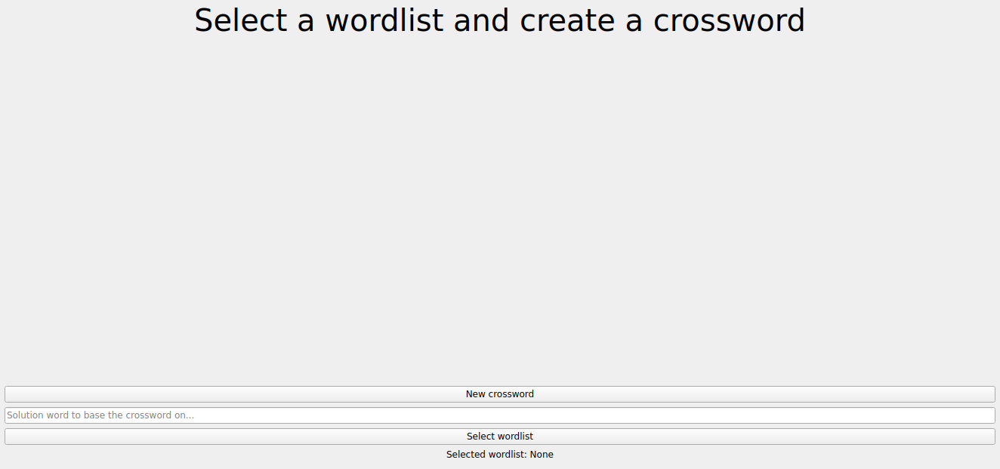
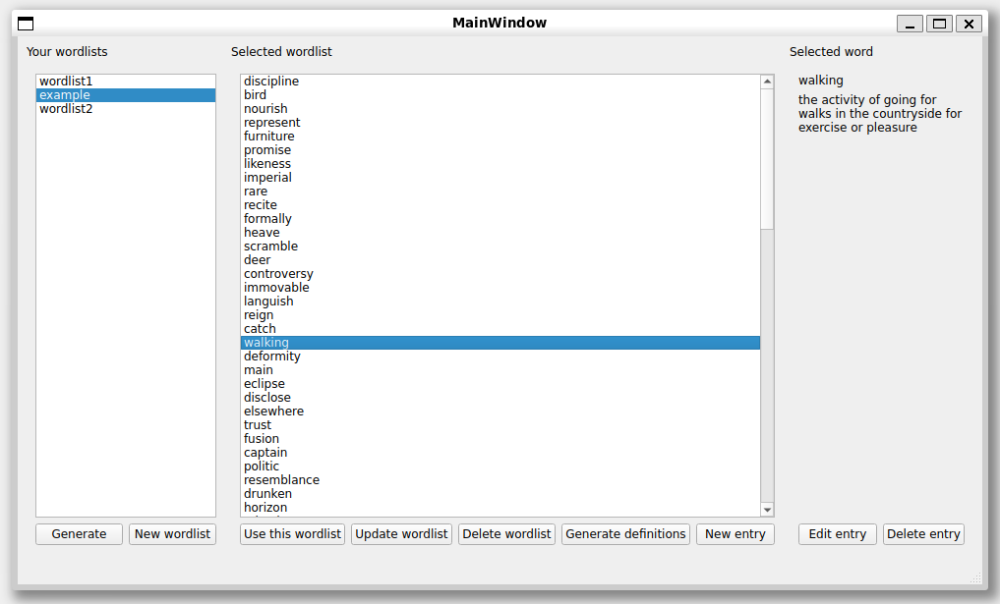
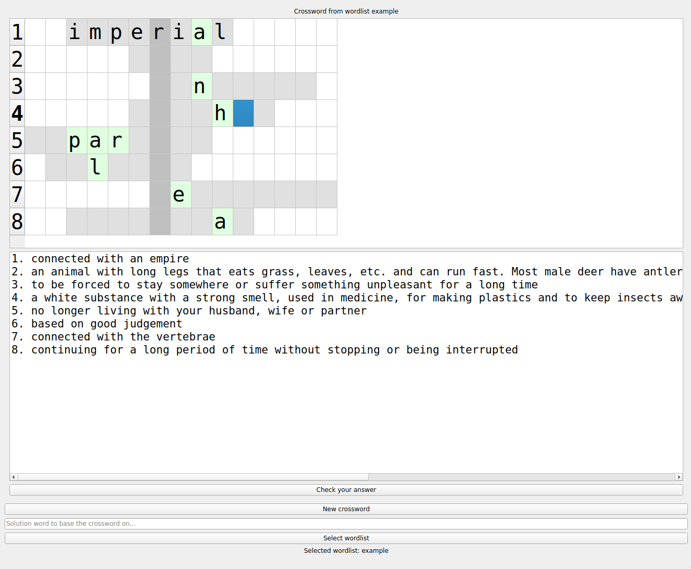

# x-infinity

## Dane autora
Imię i nazwisko: Hubert Klimowicz

Nr indeksu: 337244

## Temat projektu
Krzyżówki.

Celem jest stworzenie programu umożliwiającego tworzenie i rozwiązywanie krzyżówek. Hasło jest słowem do odgadnięcia, a definicja, ew. synonim hasła jest jego podpowiedzią. Hasła należy pobierać ze stron internetowych powszechnie uznanych słowników, przy użyciu bibliotek
typu `requests` lub `BeautifulSoup`.

Generowane krzyżówki mają być różnych wielkości i poziomów trudności, przy czym poziom trudności może być modelowany dowolną heurystyką.

Program nie powinien pobierać całego słownika, zalecane jest również generowanie krzyżówek bez dostępu do internetu, poprzez użycie
wcześniej wygenerowanych treści.

## Klasy

### Klasy zaplecza (backend)
`CrosswordGenerator` - odpowiada za generowanie krzyżówek, przy czym tworzy je zarówno w oparciu o losowe słowa, jak i o wybrane z podanej
wcześniej listy słów.

`Crossword` - krzyżówka, która trzyma w sobie rozwiązanie oraz obecny stan jej komórek. Ten drugi może być modyfikowany przez użytkownika.

`WordScraper` - odpowiada za pobieranie haseł i ich definicji ze stron słownika Oxford Learner's Dictionary. Hasła są w języku angielskim.

`Entry` - pojedyncza para hasło - definicja.

`Letter` - pojedyncza litera w krzyżówce, może być ustawiona na zamrożoną (po to, żeby nie modyfikować jej w krzyżówce).

`WordlistFileAccess` - odpowiada za zarządzanie listami słów w systemie plików.

`Wordlist` - pojedyncza, nazwana lista słów, używana do generowania krzyżówek na ich podstawie. Zapisywane są w systemie plików, w katalogu `data`.

`EmptyEntryError`, `InvalidCrosswordError`, `ConflictingEntryNameError`, `CrosswordGenerationError`, `InvalidWordlistNameError`, `InvalidLetterError` - 
klasy odpowiadające za reprezentację różnych błędów występujących w aplikacji.

Do większości klas zaplecza (zgodnie z rozsądkiem) zostały napisane testy. Znajdują się one w katalogu `tests`.

### Klasy UI:
`CrosswordTable` - tabela, która zawiera krzyżówkę, można ją obsługiwać naciskaniem klawiszy na klawiaturze.

`CrosswordWindow` - okno główne, w którym rozwiązuje się krzyżówki.

`NewEntryDialog` - okno dialogowe dodawania hasła do listy słów.

`CreateWordlistdialog` - okno dialogowe dodawania listy słów.

`UpdateEntryDialog` - okno dialogowe aktualizacji hasła.

`UpdateWordlistDialog` - okno dialogowe aktualizacji nazwy listy słów.

`WordlistWindow` - okno zarządzania listami słów oraz hasłami.

Klasy UI dziedziczą po klasach wygenerowanych przez `pyside6-uic`, znajdujących się w katalogu `ui_widgets`.

## Instrukcja
### Uruchomienie projektu
Na początek należy sklonować to repozytorium.

Po wejściu do katalogu projektu uruchomić komendy:
```
python3 -m venv .venv
source .venv/bin/activate
pip install -r requirements.txt
python3 main.py
```

### Zarządzanie krzyżówkami
Do okna zarządzania krzyżówkami wchodzi się poprzez wciśnięcie przycisku **Select Wordlist**, na dole ekranu głównego:


W tym oknie można dodawać listy słów oraz hasła z ich definicjami, ale również można je usuwać i modyfikować.


Istnieje również opcja generowania list słów, która pozwoli na stworzenie nowej listy haseł z już przypisanymi do nich definicjami
("Generate" po lewej stronie).

Oprócz tego można przypisywać definicje automatycznie do niektórych słów (z listy w `full_data.json`). Służy do tego przycisk "Generate definitions", już bardziej po prawej stronie.

Kliknięcie przycisku "Use this wordlist" zamyka to okno i wybiera odpowiednią listę słów.

### Rozwiązywanie krzyżówki


Krzyżówkę uzupełnia się, najpierw wybierając kursorem myszy odpowiednie pole, a następnie naciskając klawisze na klawiaturze.

#### Sterowanie
- dowolna litera a-z, w alfabecie angielskim - wpisuje literę w obecne pole, po czym przesuwa kursor do następnego pola.
- spacja - przesuwa kursor do następnego pola.
- backspace - usuwa literę z obecnego pola.
- strzałki - przemieszczają kursor na odpowiednie sąsiednie pole.
- podwójne kliknięcie na pole - ujawnia literę. Ta litera jest automatycznie zamrożona i nie można jej modyfikować.

#### Sprawdzanie
Żeby sprawdzić krzyżówkę, należy nacisnąć przycisk "Check your answer", na dole okna głównego. Poprawne pola wyświetlają się na zielono, natomiast niepoprawne - na czerwono. Żeby wyjść z trybu sprawdzania, należy nacisnąć ten sam przycisk ponownie.

#### Generowanie w oparciu o dane hasło główne
Wpisanie dowolnego niepustego słowa w pasku na dole okna głównego spowoduje, że kolejne krzyżówki będą generowane w oparciu o to słowo jako hasło główne.

### Skrypt do pobierania danych
Uruchomienie
```
python3 data.py
```
Skrypt ten pobiera dane ze stron internetowych i zapisuje je do pliku `full_data.json`. Teoretycznie powinien zawierać do 5000 haseł i ich definicji. W praktyce posiada ok. 3450 haseł (stan z 12.01.25), bo nie wszystkie hasła mają swoje odpowiedniki w Oxford Learner's Dictionary.

## Refleksje
Przed pisaniem projektu x-infinity miałem już wcześniej doświadczenie w postaci pisania różnych projektów, aczkolwiek nie były to projekty pisane obiektowo, a tym bardziej nie w Pythonie. Dzięki temu projektowi zadomowiłem się nieco bardziej z programowaniem obiektowym.

W mojej opinii projekt realizuje wszystkie założenia podane w temacie:
- hasła są w języku angielskim,
- są one pobierane z Oxford Learner's Dictionary, poprzez użycie biblioteki `BeautifulSoup` oraz `aiohttp`, czyli asynchronicznego odpowiednika `requests`, dzięki któremu procedura wysyłania ok. 5000 żądań HTTP była znacząco przyspieszona,
- jednocześnie program nie pobiera słownika w trakcie korzystania z aplikacji - dane są generowane skryptem `data.py` poza korzystaniem z aplikacji, a następnie odczytywane z `full_data.json`.
- poziom trudności jest konfigurowalny trojako: przez możliwość generowania krzyżówki na podstawie danego hasła głównego (o dowolnej długości), przez możliwość doboru listy słów z łatwiejszymi lub trudniejszymi słowami i przez możliwość odkrywania liter w krzyżówce.

Najbardziej złożonym zagadnieniem jest generowanie krzyżówki. Można zrobić to w sposób gwarantujący rezultat, o ile ten istnieje (projekt tego nie implementuje) - mianowicie zastosować algorytm na znajdowanie kojarzenia haseł z listy słów z literami hasła głównego. Zdecydowałem się nie korzystać z tego rozwiązania, ponieważ jest ono przekomplikowane w stosunku do wielkości efektu widoczego po stronie użytkownika. Ostatecznie zdecydowałem się dobierać hasła losowo.

Generowanie krzyżówek z hasłami ułożonymi **poziomo i pionowo** jest jeszcze trudniejsze i nie było wymagane w projekcie (ustalone na konsultacjach).

Kod projektu (tj. nazwy zmiennych, klas, metod, dokumentacja) jest napisany po angielsku - jest to nawyk wyrobiony z wcześniejszych projektów.
